<h1 align="center">AI 原理图解</h1>

<p align="center"><code>ai-tujie</code></p>

<p align="center"><em>「一张图看清结构，六张图讲明白原理。」</em></p>

<p align="center">
  
  
  
</p>

用 3:4 竖版图文讲清楚 AI 里常见的概念。每套 7 张：第 1 张是一张流程图、时序图或架构图，后面几张用文字把东西讲明白。

| # | 主题 | 封面 |
|---|---|---|
| 01 | [AI 行业分几层？](01-AI行业划分) | 分层架构图 |
| 02 | [AI 公司跨几层？](02-AI行业归类) | 跨层布局图 |
| 03 | [大模型怎么写字？](03-LLM运行原理) | 逐词预测图 |
| 04 | [大模型有几种？](04-大模型类型) | 分类矩阵图 |
| 05 | [模型是怎么练的？](05-预训练) | 训练流水线图 |
| 06 | [模型怎么变听话？](06-后训练) | 阶段流程图 |
| 07 | [模型会突然开窍吗？](07-涌现) | 规模—能力曲线图 |
| 08 | [模型底下是什么？](08-AIinfra) | 分层架构图 |
| 09 | [模型 API 怎么调？](09-模型API怎么调) | 调用架构图 |
| 10 | [一次请求能装多少？](10-上下文窗口) | 容器分区图 |
| 11 | [账单为什么差一半？](11-缓存命中) | 前缀对比图 |
| 12 | [提示词怎么写？](12-提示词工程) | 结构拆解图 |
| 13 | [上下文怎么管？](13-上下文工程) | 上下文结构图 |
| 14 | [RAG 是什么？](14-RAG) | 双段管线图 |
| 15 | [Agent 循环是什么？](15-Agent循环) | 环形流程图 |
| 16 | [Skill 怎么运行？](16-Skill运行原理) | 加载时序图 |
| 17 | [MCP 是什么？](17-MCP) | 协议架构图 |
| 18 | [沙箱，防什么？](18-沙箱) | 内外边界图 |
| 19 | [AI 名词怎么记？](19-AI名词解释) | 分段词表图 |
| 20 | [知识库怎么搭？](20-LLM知识库搭建) | 搭建流程图 |
| 21 | [AI 怎么记住事？](21-AI记忆) | 跨会话记忆分流图 |
| 22 | [AI 怎么动手？](22-工具调用) | 模型与工具时序图 |
| 23 | [Skill 该如何制作](23-Skill制作) | Skill 结构与加载图 |
| 24 | [Agent 的架构解析](24-Agent架构) | Agent 分层架构图 |
| 25 | [Agent 的基准评测](25-Agent基准评测) | 基准任务与判分图 |
| 26 | [通用与个人 Agent](26-通用与个人Agent) | 两种产品取向对照图 |

编号是整个系列的排期编号，26 套图组已全部完成。阅读路径是"看清这一行 → 模型怎么来的 → 怎么用上它 → 让它干好活 → 让它自己干 → 看懂并搭好 Agent"。图组完成不代表已经发布。

23–26 于 2026-10-09 按官方文档与原始论文重做，内容依次是 Skill 制作、Agent 架构、公开基准评测和通用 / 个人 Agent。最后一组使用便于理解产品的分类视角，具体产品可能同时具有两类能力。

## 预览

<table>
<tr>
<td></td>
<td></td>
<td></td>
</tr>
<tr>
<td></td>
<td>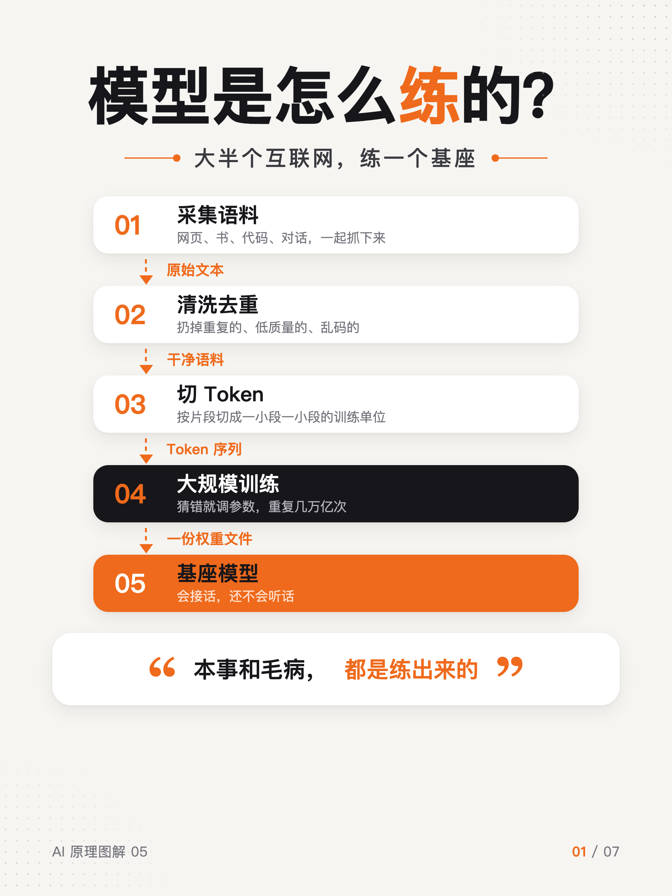</td>
<td>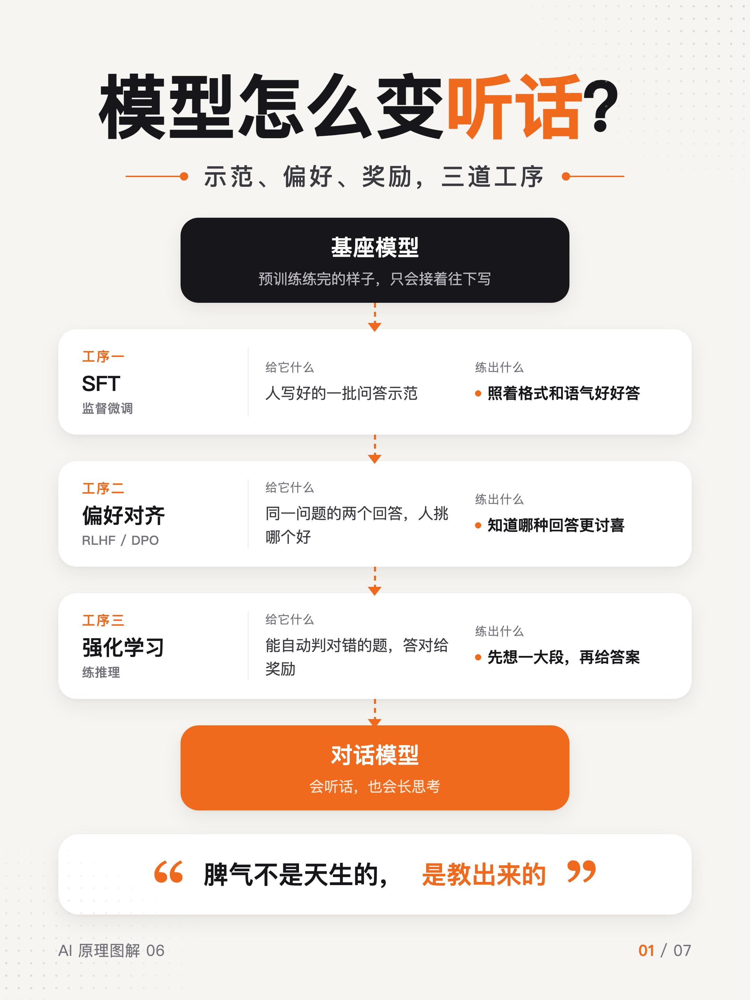</td>
</tr>
<tr>
<td>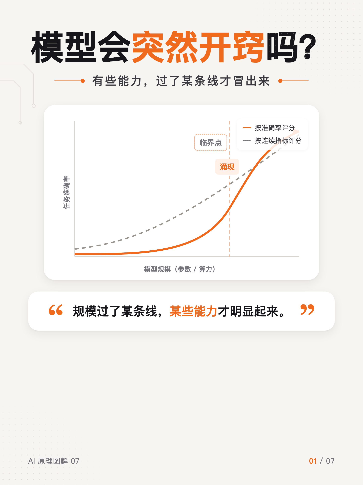</td>
<td>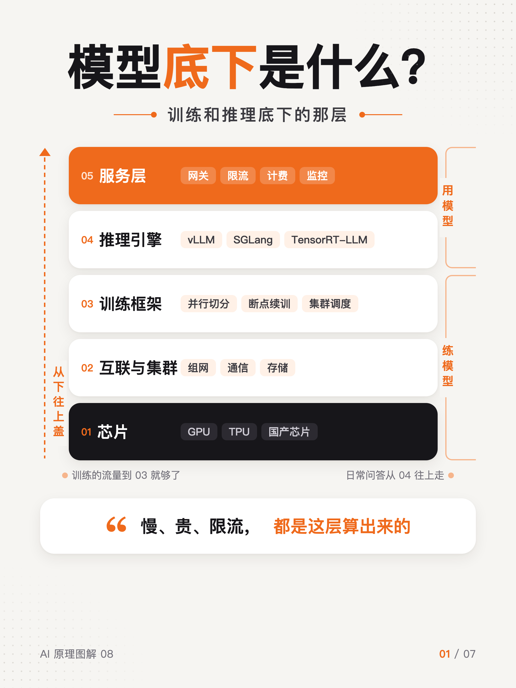</td>
<td></td>
</tr>
<tr>
<td>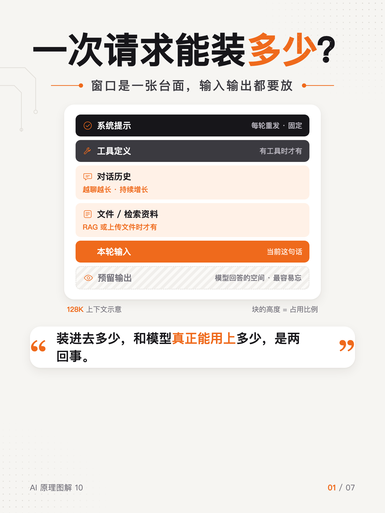</td>
<td></td>
<td></td>
</tr>
<tr>
<td></td>
<td>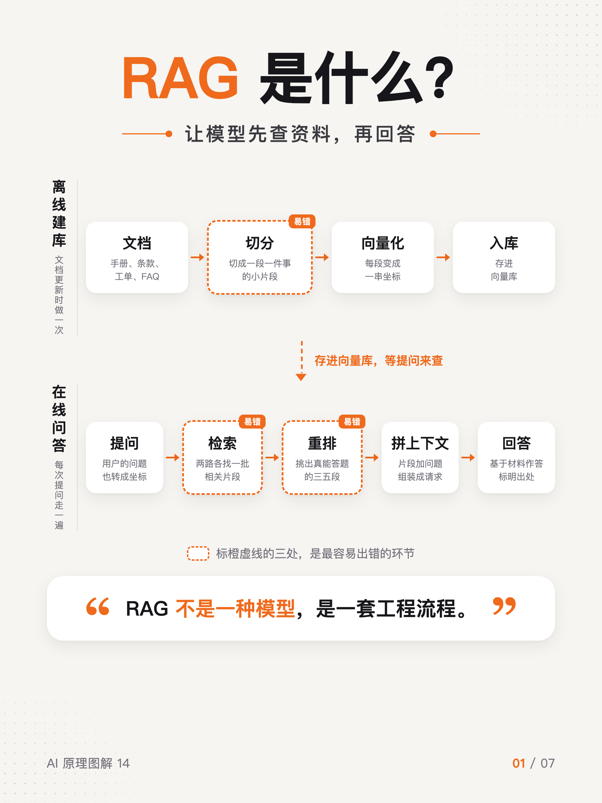</td>
<td></td>
</tr>
<tr>
<td></td>
<td></td>
<td>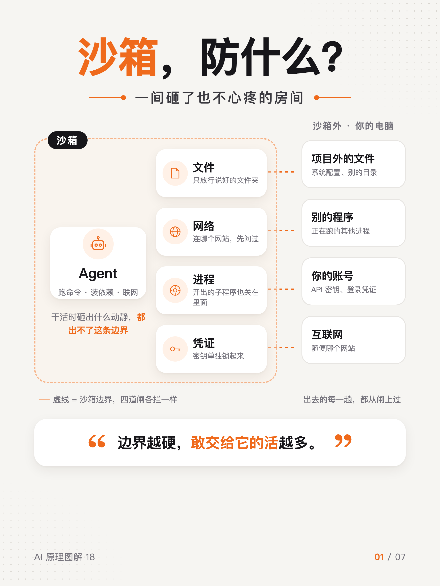</td>
</tr>
<tr>
<td></td>
<td>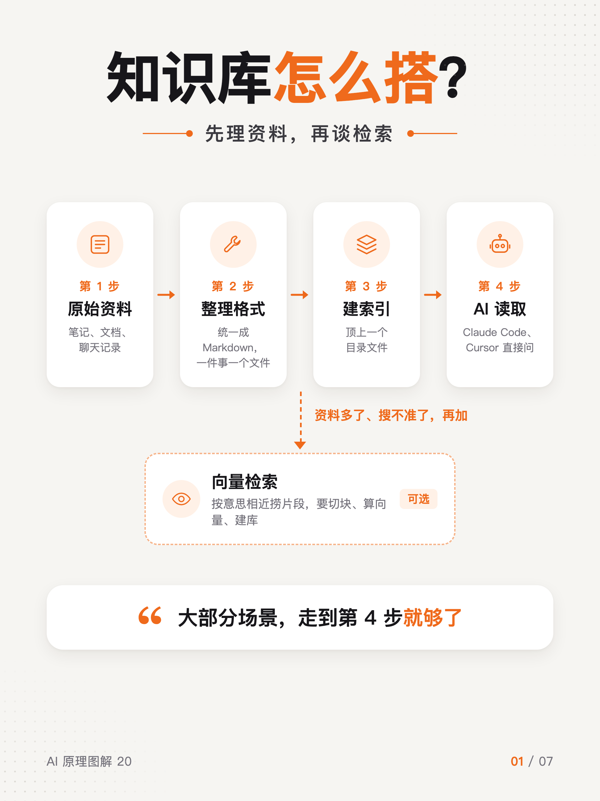</td>
</tr>
<tr>
<td>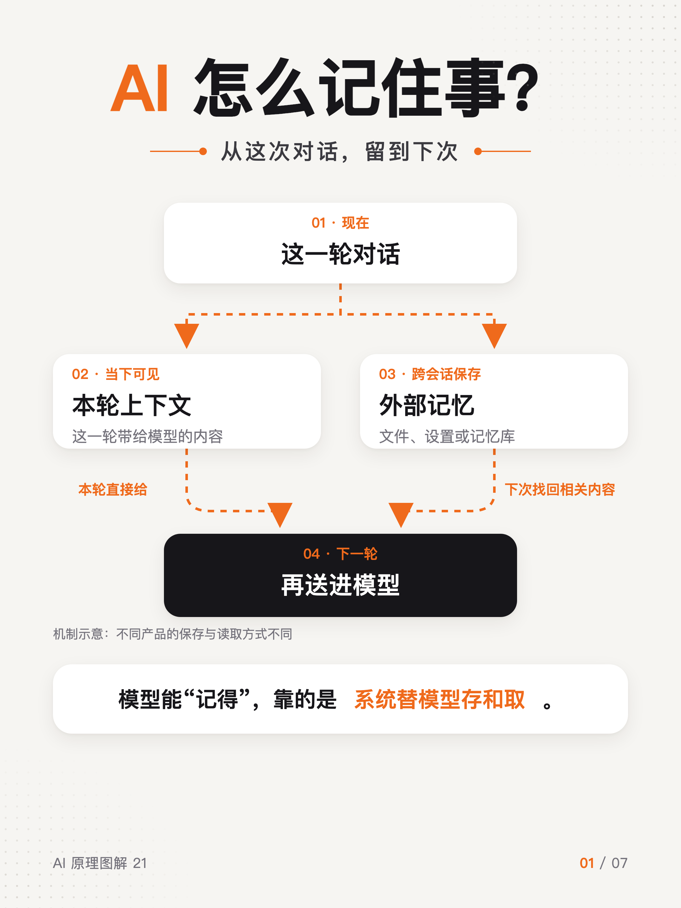</td>
<td>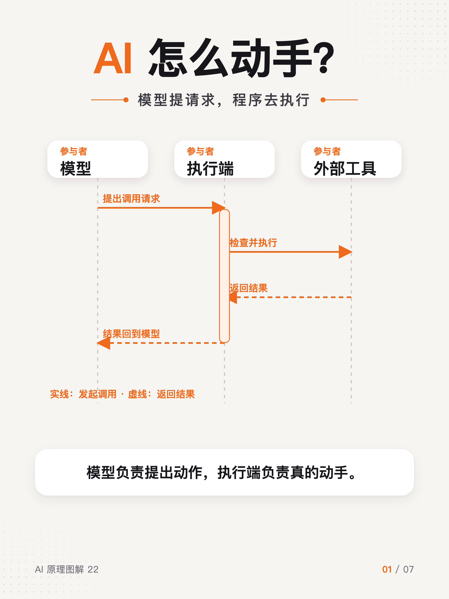</td>
<td>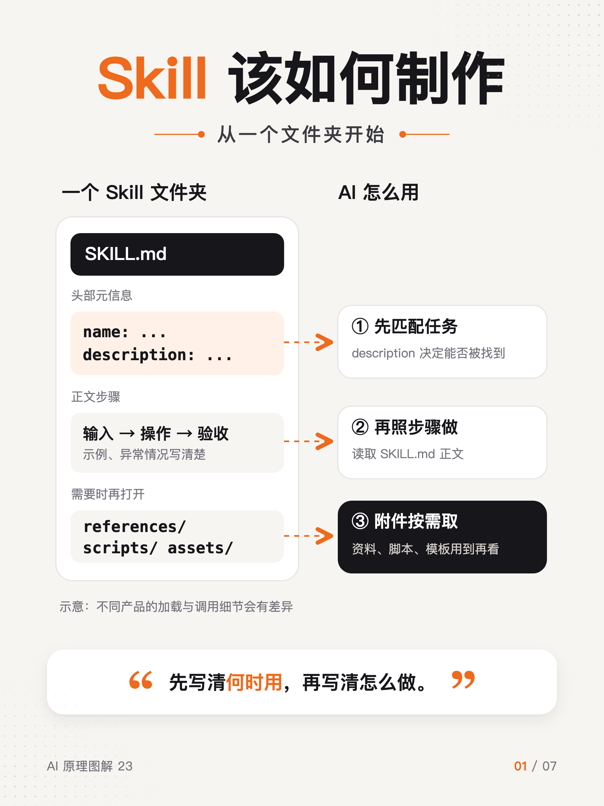</td>
</tr>
<tr>
<td>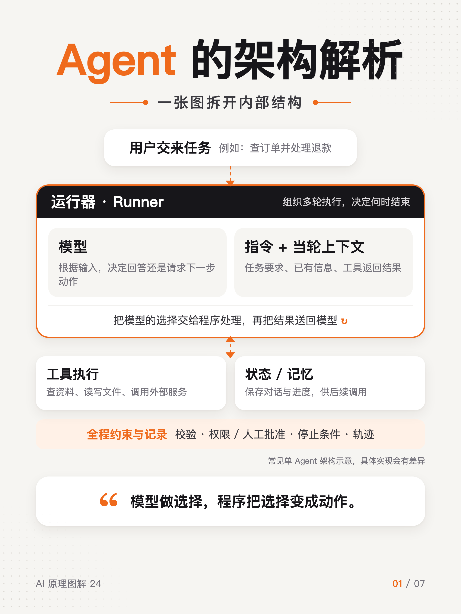</td>
<td>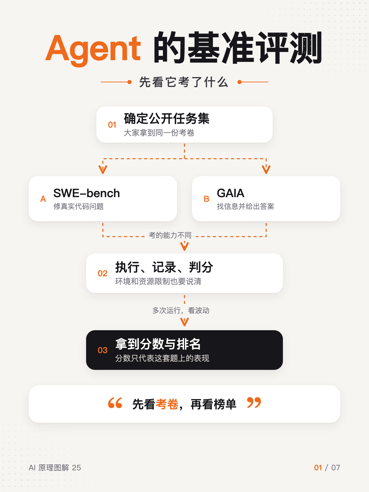</td>
<td>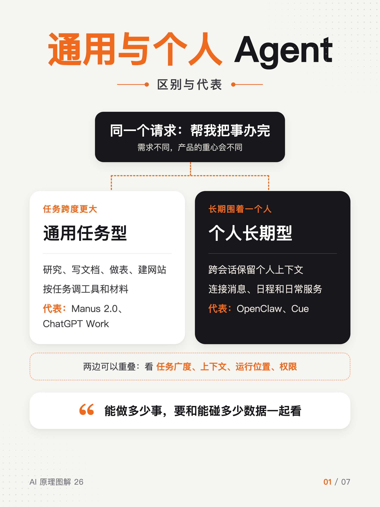</td>
</tr>
</table>

## 快速开始

每个文件夹里：

- `01.png` – `07.png`：成图，2160×2880（3:4）
- `*.html`：源文件，一页一个 `<section>`，改文字直接改这里
- `render.sh`：重新导出 PNG

## 使用

进入对应图组，修改 HTML 后重新导出：

```bash
cd 16-Skill运行原理
./render.sh Skill运行原理.html     # 需要本机装有 Google Chrome
```

字体用的是苹方（PingFang SC），在 macOS 上导出效果最好。

## 23–26 的资料

核对日期：2026-10-09。图中示意结构用于解释原理，不代表任何一家产品的完整内部实现。

- Skill 制作：[OpenAI Skills](https://developers.openai.com/api/docs/guides/tools-skills)、[Anthropic Skill authoring best practices](https://platform.claude.com/docs/en/agents-and-tools/agent-skills/best-practices)
- Agent 架构：[Anthropic Building effective agents](https://www.anthropic.com/engineering/building-effective-agents)、[OpenAI Agents SDK](https://developers.openai.com/api/docs/guides/agents/sdk)
- 基准评测：[SWE-bench](https://www.swebench.com/)、[GAIA 论文](https://arxiv.org/abs/2311.12983)、[Anthropic Agent evals](https://www.anthropic.com/engineering/demystifying-evals-for-ai-agents)
- 通用与个人 Agent：[Manus 2.0 与 Cue](https://manus.im/en/blog/introducing-manus-2-0)、[ChatGPT Work](https://openai.com/index/chatgpt-for-your-most-ambitious-work/)、[OpenClaw](https://docs.openclaw.ai/start/openclaw)

## 许可

仓库目前没有单独声明开源许可。
