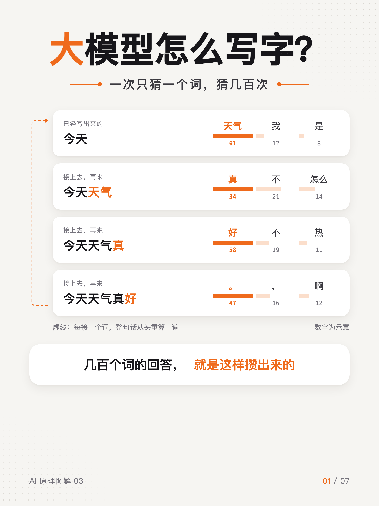
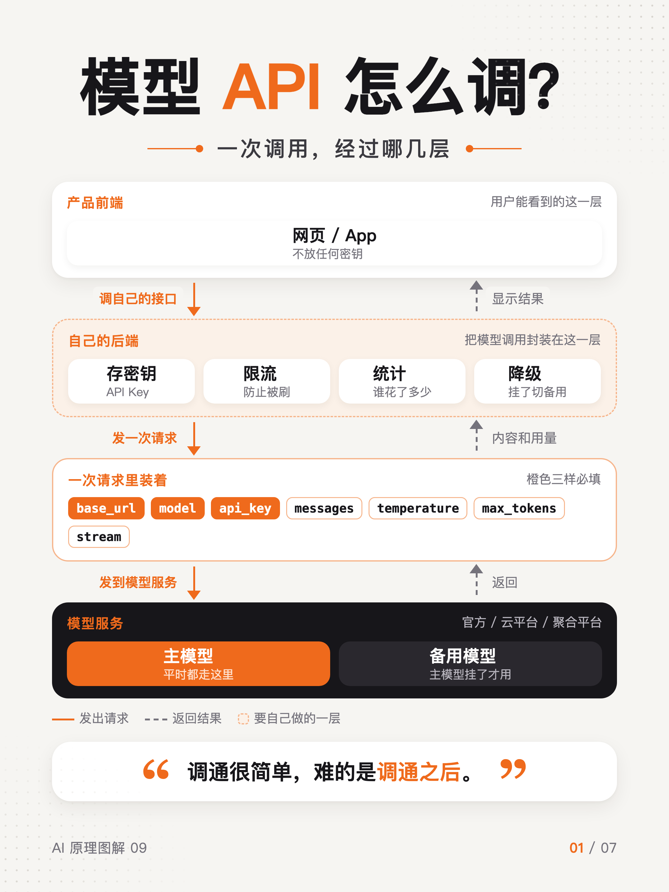
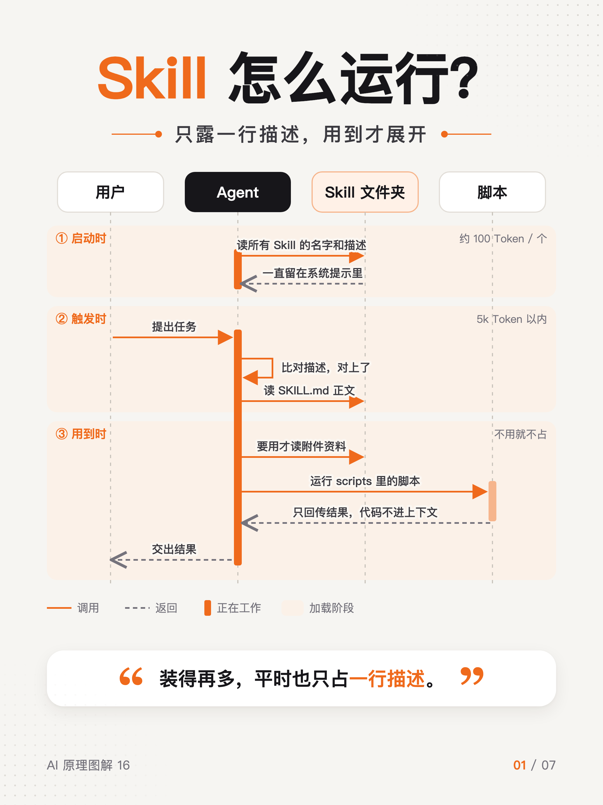
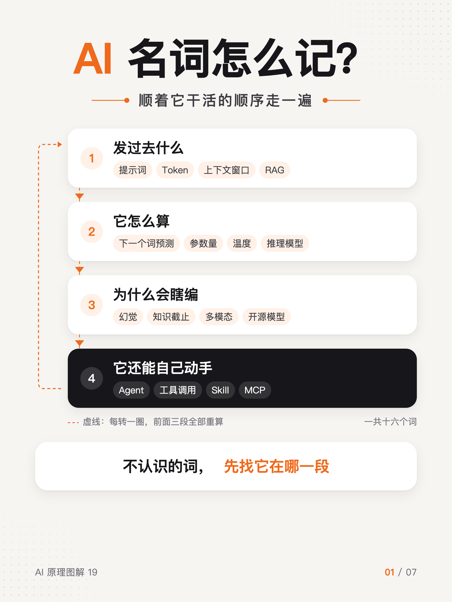

# AI 原理图解

用 3:4 竖版图文讲清楚 AI 里常见的概念。每套 7 张：第 1 张是一张流程图、时序图或架构图，后面几张用文字把东西讲明白。

| # | 主题 | 封面 |
|---|---|---|
| 01 | [AI 行业分几层？](01-AI行业划分) | 分层架构图 |
| 03 | [大模型怎么写字？](03-LLM运行原理) | 逐词预测图 |
| 04 | [大模型有几种？](04-大模型类型) | 分类矩阵图 |
| 09 | [模型 API 怎么调？](09-模型API怎么调) | 调用架构图 |
| 11 | [账单为什么差一半？](11-缓存命中) | 前缀对比图 |
| 12 | [提示词怎么写？](12-提示词工程) | 结构拆解图 |
| 13 | [上下文怎么管？](13-上下文工程) | 上下文结构图 |
| 15 | [Agent 循环是什么？](15-Agent循环) | 环形流程图 |
| 16 | [Skill 怎么运行？](16-Skill运行原理) | 加载时序图 |
| 17 | [MCP 是什么？](17-MCP) | 协议架构图 |
| 19 | [AI 名词怎么记？](19-AI名词解释) | 分段词表图 |

编号是整个系列的排期编号，后面会陆续补上 RAG、上下文窗口、预训练、后训练、沙箱等主题。

## 预览

<table>
<tr>
<td></td>
<td></td>
<td></td>
</tr>
<tr>
<td></td>
<td></td>
<td></td>
</tr>
<tr>
<td></td>
<td></td>
<td></td>
</tr>
<tr>
<td></td>
<td></td>
</tr>
</table>

## 文件说明

每个文件夹里：

- `01.png` – `07.png`：成图，2160×2880（3:4）
- `*.html`：源文件，一页一个 `<section>`，改文字直接改这里
- `render.sh`：重新导出 PNG

```bash
cd 16-Skill运行原理
./render.sh Skill运行原理.html     # 需要本机装有 Google Chrome
```

字体用的是苹方（PingFang SC），在 macOS 上导出效果最好。
